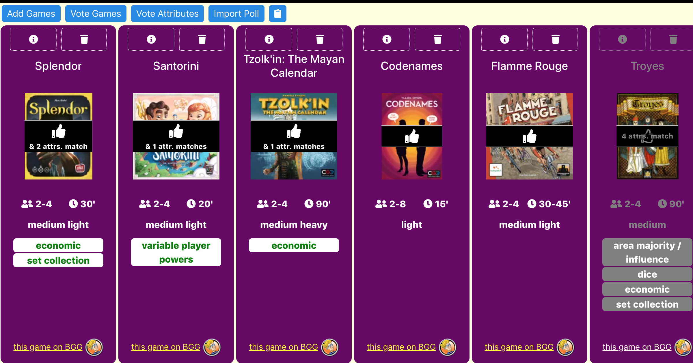

([click here to visit this app on the Internet!](https://roderickwoodman.github.io/boardgameinator/))

## Boardgameinator

*A board game comparison site*

<p align="center">
  
</p>

### What is this thing?

Behold, the **BOARDGAMEINATOR**!  (...said in my best [Dr. Doofenshmirtz](https://www.youtube.com/watch?v=Sj7yxI-r_ag) accent)

This app is a sandbox that lets you prioritize a list of board games that you are considering either playing or purchasing.

Any board game that has been added to this site can be upvoted. And any characteristic of these games, like the theme or the player count for example, can be upvoted too.

### Who is it for?

First of all, **Boardgameinator** *is not for* geeks to manage their huge collections. 

Instead, this app *is for* regular people who need help selecting a board game. It can be overwhelming these days with so many titles being published every year.

This app is also for groups of board gamers to conduct polls on which games to play at an upcomming game night.
### What do I do with it?

It is easy to build and upvote a list of board games.
1. **Add a Game.** Click the "Add" button to add a board game by its title. 
2. **Upvote Attributes.** Click the "Vote Attributes" button to upvote an attribute across all games.
3. **Upvote Games.** Either click the "Vote Titles" button or click on a thumbnail to upvote the game itself.

If you need more information about any game before you make a decision to upvote, click the info button on a game card and you will get a brief description.

### What else can I do with it?

It is also easy to vote in a poll.
1. **Login.** Click the silhouette icon to pick a username for poll voting.
2. **Import Poll.** Click the "Import Poll" button to replace the current game list with an online poll.
3. **Upvote Games.** Either click the "Vote Titles" button or click on a thumbnail to upvote the game itself.

Polls that are still open will have a countdown timer. Polls that are closed will have the winning game(s) declared.

Note that only game titles can be polled across other users. Game attribute upvotes are not shared.

### Why is it so awesome?

The likability of any board game is so subjective and multifactorial, in the same way that a novel is. And the primary online resource for the board game industry, [BoardGameGeek](https://boardgamegeek.com) (BGG), is not great for making the arbitrary comparisons that are needed to pare down a list because it is organized like an encyclopedia.

**Boardgameinator**, however, displays each game's makeup side-by-side along with sorting and filtering controls. This allows users to converge on the right game based on preferences, in a way that is similar to an e-commerce shopping experience.

### ...But wait, there's more! Sharing your game lists (URL shortcuts)

Lists of games added to this app can be shared via a straightforward URL syntax which includes either the BoardGameGeek game IDs or the Boardgameinator poll IDs...

* **Share a new list of games:**
``` https://roderickwoodman.github.io/boardgameinator/?newlist=194789+148228+11 ```

* **Share an additional set of games:**
``` https://roderickwoodman.github.io/boardgameinator/?addtolist=194789+148228+11 ```

* **Share a Boardgameinator poll of games:**
``` https://roderickwoodman.github.io/boardgameinator/?poll=1610263515000 ```

<p align="center">
  
</p>

### ...Coming soon! Creating a poll

Users who are logged in can create polls and vote on them with other users.

### DISCLAIMER

This app has been designed for the author's needs only, in the author's spare time. By using this app, you are accepting it as-is.

For most people, [the link above](https://roderickwoodman.github.io/boardgameinator/) will take you to the live, production version of the app on the Internet. But for developers who would like more...

### (For Developers) What is it doing under the hood?

Game data is pulled from [the BoardGameGeek API](https://boardgamegeek.com/wiki/page/BGG_XML_API2). All data is stored locally within the user's browser (aka: "local storage"). 

API calls are minimized because when games are deleted, their data is kept so that subsequent calls for the same game ID are directed to cache. 

There are no user sessions or sensitive data for this application. All personalization is kept in local storage and retrieved on browser refresh.

### (For Developers) Running this app locally

As a one-time setup, copy the code for this app to your local machine. 
```
git clone https://github.com/roderickwoodman/boardgameinator.git
cd boardgameinator
npm install
```

Now, every time you want to run the app, just run a script that starts up a development server with the code. This will run the app in development mode.
```
npm start
```

Doing this will open a browser tab for viewing the app at [http://localhost:3000](http://localhost:3000). The page will reload if you make edits to your local code copies. You will also see any lint errors in the browser console. 
